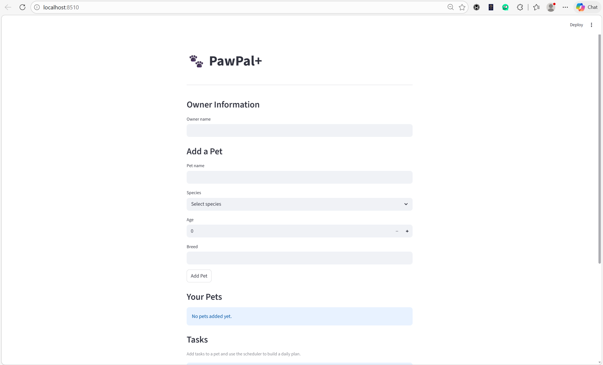
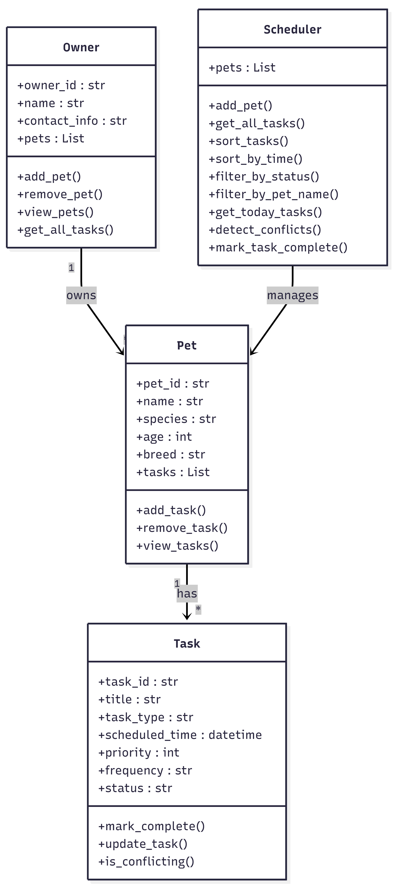
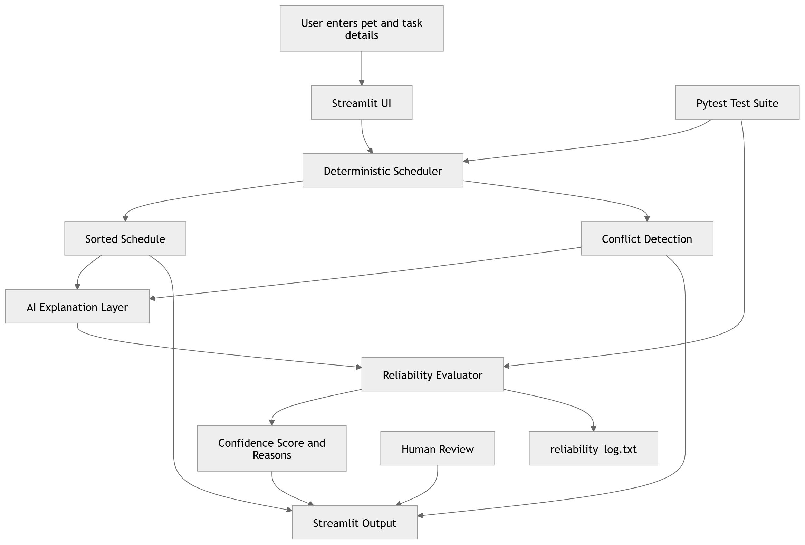

# PawPal+ AI Planner (Applied AI System)

An AI-powered pet care scheduling system with explanation and reliability scoring.

## 🔹 Original Project (Modules 1–3)

This project extends my original PawPal+ scheduler built in earlier modules.  
The initial version allowed users to create pets, assign tasks, sort them by time, and detect scheduling conflicts.

The current version enhances this system by integrating AI-based explanation and reliability evaluation.

## Scenario

A busy pet owner needs help staying consistent with pet care. They want an assistant that can:

- Track pet care tasks (walks, feeding, meds, enrichment, grooming, etc.)
- Consider constraints (time available, priority, owner preferences)
- Produce a daily plan and explain why it chose that plan

Your job is to design the system first (UML), then implement the logic in Python, then connect it to the Streamlit UI.

## Project Summary

PawPal+ AI Planner is an applied AI system that helps pet owners organize and understand their daily pet care schedules.

The system not only generates schedules but also:
- Explains how the schedule was created
- Detects conflicts and warns users
- Assigns a reliability score (1–5)
- Logs decisions for transparency

This ensures the system is both useful and trustworthy.

## What you will build

Your final app should:

- Let a user enter basic owner + pet info
- Let a user add/edit tasks (duration + priority at minimum)
- Generate a daily schedule/plan based on constraints and priorities
- Display the plan clearly (and ideally explain the reasoning)
- Include tests for the most important scheduling behaviors

## Features

PawPal+ includes several intelligent scheduling features to help pet owners manage care tasks effectively.

- **Task Scheduling** – Add tasks for each pet with a scheduled time and priority.
- **Sorting by Time** – Tasks are automatically sorted chronologically to create a clear daily plan.
- **Recurring Tasks** – Daily or weekly tasks automatically generate the next occurrence after completion.
- **Conflict Detection** – The scheduler detects when two tasks occur at the same time and shows a warning instead of crashing the program.
- **Task Filtering** – Tasks can be filtered by pet name or completion status.
- **Interactive UI** – The Streamlit interface allows users to easily add pets, create tasks, and generate schedules.

## 📸 Demo




## 💡 Sample Interactions

### Example 1: Conflict Detection

**Input:**
- Pet: Juli  
- Tasks:
  - Feeding at 10:00  
  - Feeding at 10:00  

**Output:**
- Conflict warning displayed  
- AI explanation highlights overlapping tasks  
- Reliability score: 4/5  

---

### Example 2: Clean Schedule

**Input:**
- Pet: Stormy  
- Tasks:
  - Walk at 09:00  
  - Feeding at 10:00  

**Output:**
- No conflicts detected  
- AI explanation confirms smooth schedule  
- Reliability score: 5/5  

---

## Getting started

### Setup

```bash
python -m venv .venv
source .venv/bin/activate  # Windows: .venv\Scripts\activate
pip install -r requirements.txt
```
### Run the application

```bash
streamlit run app.py

## Smarter Scheduling

PawPal+ includes several algorithmic improvements that make pet care planning more intelligent and organized.

The scheduler can:
- Sort tasks chronologically by scheduled time
- Filter tasks by pet name or completion status
- Automatically generate the next occurrence of recurring daily or weekly tasks
- Detect scheduling conflicts when two tasks occur at the same time and display a warning instead of stopping the program

These features were tested using the CLI demo script in `main.py`, which verifies sorting, filtering, recurrence handling, and conflict detection.

## Testing PawPal+

PawPal+ includes an automated test suite to verify that the scheduling system behaves correctly.

### Run the tests

```bash
python -m pytest
```

## Applied AI Feature

PawPal+ includes an AI-powered explanation and reliability system.

- Generates a natural language explanation of the schedule
- Detects conflicts and surfaces warnings
- Assigns a reliability score (1–5) based on:
  - number of tasks
  - detected conflicts
  - input completeness
- Logs each evaluation to a file for traceability

This ensures the system is transparent, testable, and trustworthy.

## System Design and Architecture
The system follows a structured pipeline where user input is collected through the Streamlit UI and passed to a deterministic scheduler.  
The scheduler sorts tasks, detects conflicts, and generates the base schedule.  
An AI layer then explains the results and evaluates reliability, producing a confidence score and logging outputs for transparency.

The diagram below shows how PawPal+ processes user input, applies scheduling logic, generates AI explanations, evaluates reliability, and presents results for human review.



##  Design Decisions

- Used object-oriented design (Owner, Pet, Task, Scheduler)
- Separated scheduling logic from UI
- Added AI as a post-processing layer for explanation and evaluation

### Tradeoff

Conflict detection currently checks only exact time matches and does not handle overlapping durations.  
This keeps the system simple and efficient for this version.

## 🧪 Testing Summary

The system was tested using pytest to verify:

- Task creation and completion
- Sorting correctness
- Recurring task behavior
- Conflict detection
- Reliability scoring

### What worked
- Scheduler logic is consistent
- AI explanation aligns with system output

### What could improve
- More edge case testing (overlapping durations, invalid inputs)

## Reliability and Evaluation

The PawPal+ AI system includes multiple mechanisms to ensure reliability and trustworthiness:

- **Automated Tests:** Core scheduling behaviors (sorting, recurrence, conflict detection) were validated using pytest.
- **Confidence Scoring:** Each generated schedule is assigned a reliability score (1–5) based on factors such as conflicts, number of tasks, and input completeness.
- **Logging:** All AI evaluations are recorded in `reliability_log.txt`, capturing task count, conflicts, and reliability scores for traceability.
- **Guardrails:** Input validation prevents invalid or incomplete data (e.g., missing task titles or priority selection).

### Evaluation Results

- All core scheduling tests passed successfully using pytest.
- Reliability scores typically ranged between **4/5 and 5/5** for valid schedules.
- Lower scores occurred when:
  - Tasks had conflicting times
  - Inputs were incomplete or missing
- System accuracy improved after adding validation rules and clearer conflict detection.

### Human Evaluation

The system outputs (schedule, AI explanation, and reliability score) were manually reviewed to ensure:
- Explanations match the scheduler output
- No fabricated or incorrect task information is introduced
- Warnings and scores are meaningful and understandable

Overall, the system demonstrates consistent and reliable behavior for typical scheduling scenarios, with known limitations in handling overlapping task durations.

## 🔍 Reflection

This project showed how AI can enhance existing systems without replacing core logic.

Key learnings:
- AI should be guided and validated, not blindly trusted
- Reliability scoring improves trust in AI outputs
- Clear architecture is important when integrating AI

Working with AI tools required acting as the lead architect to ensure clean and maintainable design.

## ⚖️ Reflection and Ethics

### Limitations and Biases

The system has a few limitations. Conflict detection currently only checks for exact time matches and does not consider overlapping task durations. The reliability scoring is rule-based, so it may not capture more complex scheduling issues. Since the AI explanation layer is deterministic, it reflects only predefined logic and may not adapt to unusual scenarios.

---

### Potential Misuse and Prevention

The system could be misused if users rely completely on the AI output without reviewing conflicts or schedule feasibility. To prevent this:
- Conflict warnings are clearly displayed
- A reliability score highlights potential issues
- The system encourages human review instead of automated decision-making

This ensures that the AI acts as an assistant, not a decision-maker.

---

### Observations During Testing

While testing, it was surprising how small input changes (like duplicate times) significantly impacted the reliability score. This showed how important validation and guardrails are in AI systems. Adding input validation improved consistency and reduced errors.

---

### AI Collaboration Experience

AI tools like Copilot were helpful in speeding up development, especially for generating boilerplate code and structuring functions.

- **Helpful suggestion:** AI suggested using `timedelta` for implementing recurring tasks, which simplified the logic for creating future task instances.
- **Flawed suggestion:** In one case, AI generated conflict detection logic that did not properly handle task-pet relationships, resulting in unclear output. This required manual correction to ensure accurate and readable conflict messages.

Overall, this project reinforced the importance of acting as the **lead architect** when working with AI—reviewing, validating, and refining suggestions rather than accepting them blindly.

## Stretch Features

### Test Harness
A script (`test_harness.py`) was created to evaluate system performance across multiple scenarios (conflict, no conflict, empty input). It prints reliability scores and explanations.

### Agentic Workflow
The system includes a simple decision layer that recommends actions (resolve conflicts, review schedule, or proceed), adding a reasoning step beyond basic output.


## 🌐 Portfolio

### GitHub Repository
https://github.com/sagarikapatha/applied-ai-system-project

### Reflection: What this project says about me as an AI engineer

This project demonstrates my ability to design and build applied AI systems that are both functional and reliable. I focused on integrating AI as an explanation and evaluation layer, ensuring outputs are transparent, testable, and useful for real-world decisions.

It reflects my approach as an AI engineer: combining structured system design with responsible AI practices, validating outputs, and prioritizing clarity and trust over black-box behavior.

## 🎥 Video Walkthrough
https://www.loom.com/share/aef6784330a44f8ca2eaa80e21dfcd73

